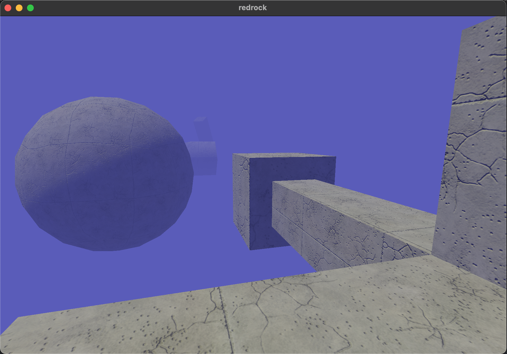

# redrock
This is a work-in-progress hobby game engine. My goal is to create a lightweight 3D data-driven engine for personal use making a retro game. Redrock is built with Rust and WebGPU.

```sh
cargo run
```


